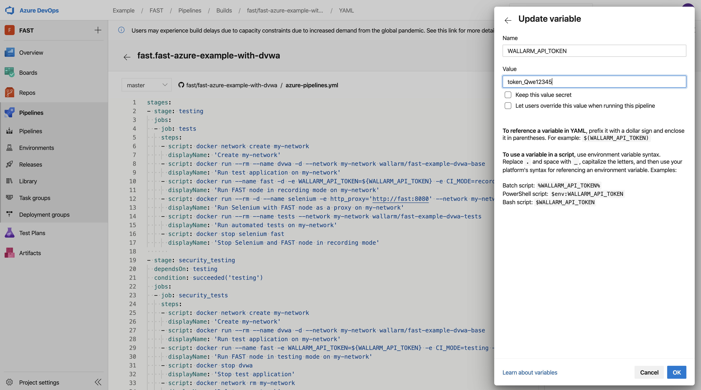
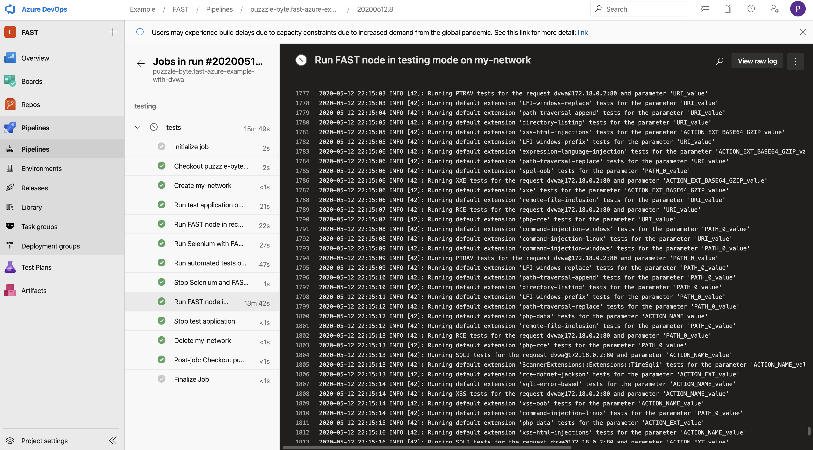

# Integration of FAST with Azure DevOps

The integration of FAST in CI MODE into the Azure DevOps pipeline is configured via the `azure-pipelines.yml` file. The detailed schema of the `azure-pipelines.yml` file is described in [Azure DevOps official documentation](https://docs.microsoft.com/en-us/azure/devops/pipelines/yaml-schema?view=azure-devops&tabs=schema%2Cparameter-schema).

!!! info "Configured workflow"
    Further instructions require already configured workflow that corresponds to one of the following points:

      * Test automation is implemented. In this case, the FAST node token should be [passed](#passing-fast-node-token) and the [request recording](#adding-the-step-of-request-recording) and [security testing](#adding-the-step-of-security-testing) steps should be added.
      * The set of baseline requests is already recorded. In this case, the FAST node token should be [passed](#passing-fast-node-token) and the [security testing](#adding-the-step-of-security-testing) step should be added.

## Passing FAST Node Token

To securely use the [FAST node token](../../operations/create-node.md), open your current pipeline settings and pass the token value in the [Azure DevOps environment variable](https://docs.microsoft.com/en-us/azure/devops/pipelines/process/variables?view=azure-devops&tabs=yaml%2Cbatch#environment-variables).



## Adding the Step of Request Recording

--8<-- "../include/fast/fast-cimode-integration-examples/request-recording-setup.md"

<br>



```
- job: tests
  steps:
  - script: docker network create my-network
    displayName: 'Create my-network'
  - script: docker run --rm --name dvwa -d --network my-network wallarm/fast-example-dvwa-base
    displayName: 'Run test application on my-network'
  - script: docker run --name fast -d -e WALLARM_API_TOKEN=$WALLARM_API_TOKEN -e CI_MODE=recording -e WALLARM_API_HOST=us1.api.wallarm.com -e ALLOWED_HOSTS=dvwa -p 8080:8080 --network my-network --rm wallarm/fast
    displayName: 'Run FAST node in recording mode on my-network'
  - script: docker run --rm -d --name selenium -e http_proxy='http://fast:8080' --network my-network selenium/standalone-firefox:latest
    displayName: 'Run Selenium with FAST node as a proxy on my-network'
  - script: docker run --rm --name tests --network my-network wallarm/fast-example-dvwa-tests
    displayName: 'Run automated tests on my-network'
  - script: docker stop selenium fast
    displayName: 'Stop Selenium and FAST node in recording mode'
```


## Adding the Step of Security Testing

The method of security testing setup depends on the authentication method used in the test application:

* If authentication is required, add the step of security testing to the same job as the step of request recording.
* If authentication is not required, add the step of security testing as a separate job to your pipeline.

To implement security testing, follow the instructions:

1. Make sure the test application is running. If required, add the command to run the application.
2. Add the command running FAST Docker container in the `CI_MODE=testing` mode with other required [variables](../ci-mode-testing.md#environment-variables-in-testing-mode) __after__ the command running the application.

    !!! info "Using the recorded set of baseline requests
    >
    > If the set of baseline requests was recorded in another pipeline, specify the record ID in the [TEST_RECORD_ID](../ci-mode-testing.md#переменные-в-режиме-тестирования) variable. Otherwise, the last recorded set will be used.

    Example of the command:

    ```
    docker run --name fast -e WALLARM_API_TOKEN=$WALLARM_API_TOKEN -e CI_MODE=testing -e WALLARM_API_HOST=us1.api.wallarm.com -p 8080:8080 -e TEST_RUN_URI=http://app-test:3000 --network my-network --rm wallarm/fast
    ```

!!! warning "Docker Network"
    Before security testing, make sure that the FAST node and test application are running on the same network.



Since the example below tests the application DVWA that requires authentication, the step of security testing is added to the same job as the step of request recording.

```
stages:
- stage: testing
  jobs:
  - job: tests
    steps:
    - script: docker network create my-network
      displayName: 'Create my-network'
    - script: docker run --rm --name dvwa -d --network my-network wallarm/fast-example-dvwa-base
      displayName: 'Run test application on my-network'
    - script: docker run --name fast -d -e WALLARM_API_TOKEN=$WALLARM_API_TOKEN -e CI_MODE=recording -e WALLARM_API_HOST=us1.api.wallarm.com -e ALLOWED_HOSTS=dvwa -p 8080:8080 --network my-network --rm wallarm/fast
      displayName: 'Run FAST node in recording mode on my-network'
    - script: docker run --rm -d --name selenium -e http_proxy='http://fast:8080' --network my-network selenium/standalone-firefox:latest
      displayName: 'Run Selenium with FAST node as a proxy on my-network'
    - script: docker run --rm --name tests --network my-network wallarm/fast-example-dvwa-tests
      displayName: 'Run automated tests on my-network'
    - script: docker stop selenium fast
      displayName: 'Stop Selenium and FAST node in recording mode'
    - script: docker run --name fast -e WALLARM_API_TOKEN=$WALLARM_API_TOKEN -e CI_MODE=testing -e WALLARM_API_HOST=us1.api.wallarm.com -p 8080:8080 -e TEST_RUN_URI=http://dvwa:80 --network my-network --rm wallarm/fast 
      displayName: 'Run FAST node in testing mode on my-network'
    - script: docker stop dvwa
      displayName: 'Stop test application'
    - script: docker network rm my-network
      displayName: 'Delete my-network'
```


## Getting the Result of Testing

The result of security testing will be displayed on the Azure DevOps interface.



## More Examples

You can find examples of integrating FAST to Azure DevOps workflow on our [GitHub](https://github.com/wallarm/fast-examples).

> #### Info::
> If you have questions related to FAST integration, please [contact us](mailto:support@wallarm.com).
